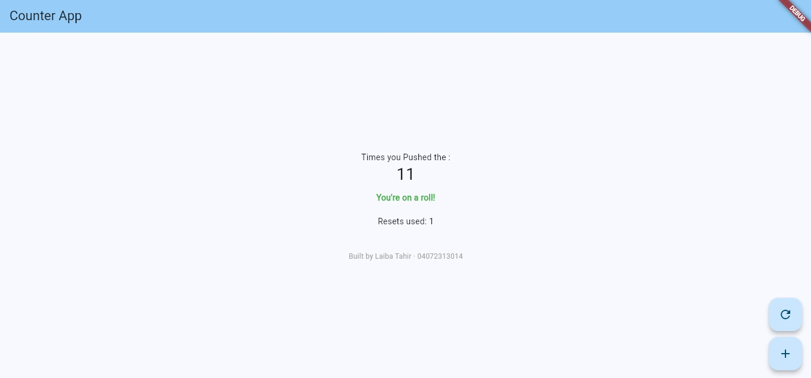

# Counter App
**Name:** Laiba Tahir
**Roll Number:** 04072313014

## What I did
- Added a reset button that sets the counter back to 0.
- Added a green message "You're on a roll!" that shows only when the counter goes above 10.
- Added a second counter that counts how many times reset was pressed.
- Changed the theme color to light blue.
- Added my name and roll number at the bottom of the screen.

## Screenshot

## Reflection
setState() tells flutter that something changed and the screen needs to update.If I just change a variable without setState(),the value changes in the background but flutter doesn't know it needs to redraw so the screen still shows the old number.Writing the change inside setState() makes the futter rebuild the widget with the new value.Thats why I've used setState() separately for increment and reset since they change different things.
